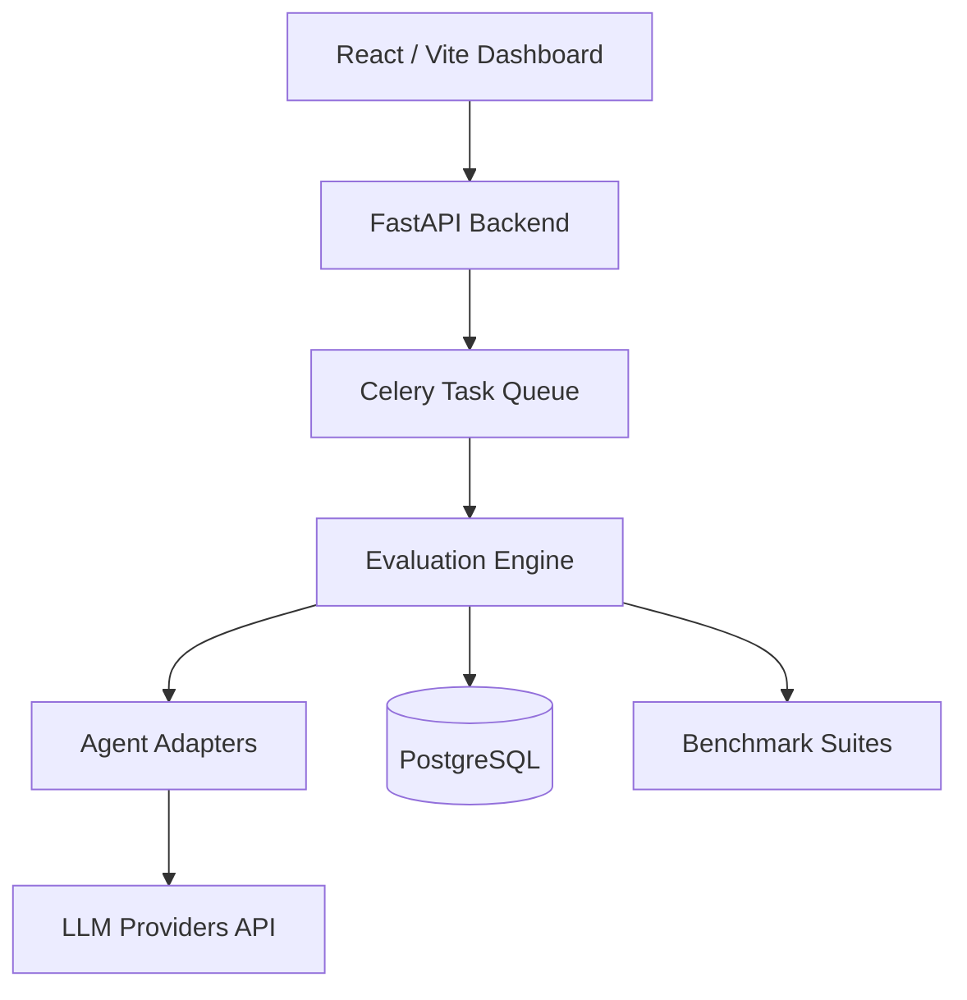

<div align="center">
  <h1>🔬 Agent Evaluation Laboratory</h1>
  <p><strong>A research platform for benchmarking autonomous AI agents across reasoning, planning, memory, tool use, reliability, and cost.</strong></p>

  <p>
    <a href="https://github.com/Satishhhh989/agent-eval-lab/actions"></a>
    <a href="https://opensource.org/licenses/MIT"></a>
    <a href="https://python.org"></a>
    <a href="https://react.dev"></a>
  </p>
</div>

---

##  Project Motivation
Most AI agent repositories demonstrate *what* agents can do. This repository **scientifically evaluates them**. The objective is to create an extensible benchmark suite that enables researchers to compare AI agents using reproducible experiments, testing reasoning, long-horizon planning, memory recall, tool efficiency, and hallucination rates.

##  Architecture

Agent Eval Lab uses a decoupled, plugin-based enterprise architecture designed around Domain-Driven Design (DDD).



##  Feature Matrix

| Feature | Description | Status |
| :--- | :--- | :--- |
| **Plugin Architecture** | Swap model providers (OpenAI, Anthropic, Local) dynamically. | 🟢 Active |
| **Comprehensive Metrics** | Accuracy, latency, cost, and hallucination tracking. | 🟢 Active |
| **Asynchronous Engine** | Celery-backed distributed evaluation pipeline. | 🟢 Active |
| **Interactive Dashboard** | React-based dark-mode visualization of leaderboards. | 🟢 Active |
| **Graph & Vector DBs** | Neo4j for planning tasks, Qdrant for memory validation. | 🟡 Planned |

##  Quick Start

### Installation

1. **Clone the repository:**
   ```bash
   git clone https://github.com/Satishhhh989/agent-eval-lab.git
   cd agent-eval-lab
   ```

2. **Backend Setup:**
   ```bash
   python3 -m venv venv
   source venv/bin/activate
   pip install -r requirements.txt
   uvicorn backend.main:app --reload
   ```

3. **Frontend Setup:**
   ```bash
   cd frontend
   npm install
   npm run dev
   ```

##  Benchmark Examples

Here is a snippet showing how easy it is to run a benchmark using the Python SDK:

```python
from core.evaluation import ExperimentEngine
from agents.openai_adapter import OpenAIAgent
from benchmarks.reasoning import ReasoningBenchmark

agent = OpenAIAgent(model="gpt-4")
benchmark = ReasoningBenchmark(dataset="gsm8k")

results = ExperimentEngine.run(agent, benchmark)
print(f"Accuracy: {results.accuracy}, Cost: {results.cost_usd}")
```

## Screenshots
*(Coming soon)*

## 🗺️ Roadmap
- [x] Core plugin architecture and database schema
- [x] Dashboard UI layout and visualizations setup
- [ ] Implement full Memory & Long Horizon benchmarks
- [ ] Add Docker Compose configurations for Qdrant and Neo4j
- [ ] Connect Live Dashboard to WebSocket telemetry

##  Contributing
We welcome contributions from researchers and engineers. Please read our `CONTRIBUTING.md` for details on our code of conduct and the process for submitting pull requests.

## Citation
If you use this platform in your research, please cite:
```bibtex
@software{AgentEvalLab2026,
  author = {Satish},
  title = {Agent Evaluation Laboratory},
  year = {2026},
  url = {https://github.com/Satishhhh989/agent-eval-lab}
}
```

##  License
This project is licensed under the MIT License - see the [LICENSE](LICENSE) file for details.

##  Acknowledgements
- Inspired by modern benchmark suites and frameworks.
- Thanks to the open-source community for providing excellent tooling (FastAPI, React, TailwindCSS).

---
**Engineered with precision for AI research.**  
*- Satish (Project Maintainer)*
